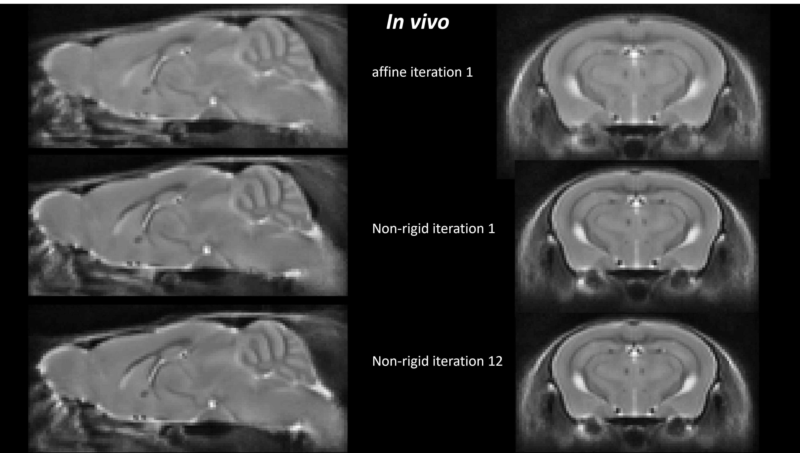

# Group-wise Registration (Average Template Creation) pipeline

This Group-wise Registration pipeline is modified from NiftyReg's original groupwise registration pipeline, which was designed for SGE pbs cluster architecture, and added the SLURM cluster compatibility.

This script can be run either locally or on SLURM cluster.

# Sample results on mouse model:

# Reference:
Original NiftyReg Groupwise registration pipeline:
- http://cmictig.cs.ucl.ac.uk/wiki/index.php/Niftyreg_Groupwise

Python wrapper using Nipype:
- https://nipype.readthedocs.io/en/1.1.7/interfaces/generated/workflows.smri/niftyreg.groupwise.html

# Paper Citation:
  - Ma, D., Cardoso, M. J., Zuluaga, M. A., Modat, M., Powell, N. M., Wiseman, F. K., Cleary, J. O., Sinclair, B., Harrison, I. F., Siow, B., Popuri, K., Lee, S., Matsubara, J. A., Sarunic, M. V, Beg, M. F., Tybulewicz, V. L. J., Fisher, E. M. C., Lythgoe, M. F., & Ourselin, S. (2020). **Substantially thinner internal granular layer and reduced molecular layer surface in the cerebellum of the Tc1 mouse model of Down Syndrome – a comprehensive morphometric analysis with active staining contrast-enhanced MRI**. NeuroImage, 117271. https://doi.org/https://doi.org/10.1016/j.neuroimage.2020.117271
  - Ma, D., Cardoso, M. J., Zuluaga, M. A., Modat, M., Powell, N., Wiseman, F., Tybulewicz, V., Fisher, E., Lythgoe, M. F., & Ourselin, S. (2015). **Grey Matter Sublayer Thickness Estimation in the Mouse Cerebellum**. In Medical Image Computing and Computer Assisted Intervention 2015 (pp. 644–651). https://doi.org/10.1007/978-3-319-24574-4_77
  - Holmes HE, Powell NM, Ma D, Ismail O, Harrison IF, Wells JA, Colgan N, O'Callaghan JM, Johnson RA, Murray TK, Ahmed Z, Heggenes M, Fisher A, Cardoso MJ, Modat M, O'Neill MJ, Collins EC, Fisher EM, Ourselin S, Lythgoe MF. **Comparison of In Vivo and Ex Vivo MRI for the Detection of Structural Abnormalities in a Mouse Model of Tauopathy. Front Neuroinform**. 2017 Mar 31;11:20. doi: 10.3389/fninf.2017.00020. PMID: 28408879; PMCID: PMC5374887.
  - Powell NM, Modat M, Cardoso MJ, Ma D, Holmes HE, Yu Y, O’Callaghan J, Cleary JO, Sinclair B, Wiseman FK, Tybulewicz VL. **Fully-automated μMRI morphometric phenotyping of the Tc1 mouse model of Down syndrome**. PLoS One. 2016 Sep 22;11(9):e0162974.
