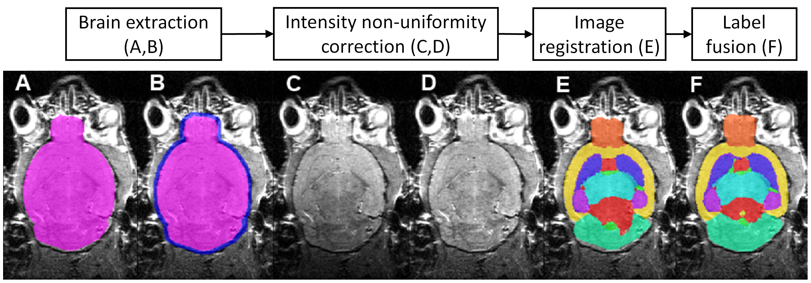
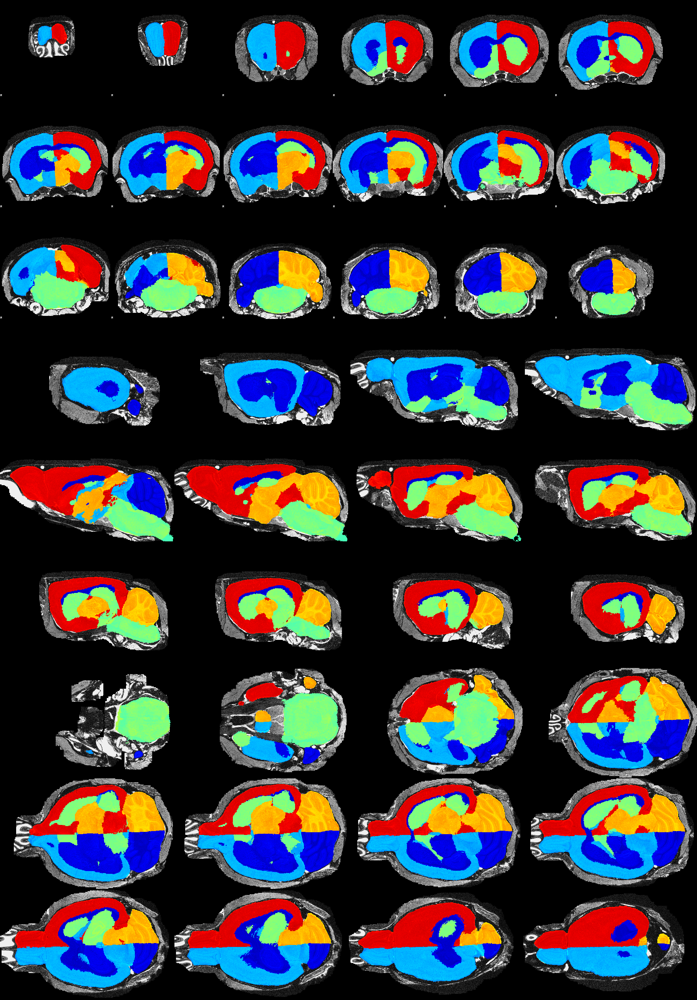

# Multi Atlas Segmentation and Morphometric Analysis Toolkit (MASMAT)

> Originally designed for mouse brain MRI, but is applicable to any spicious (e.g. Non-human primate, or even human neuroimages)

Author: Da Ma (dma@wakehealth.edu; da_ma@sfu.ca; d.ma.11@ucl.ac.uk)

## Description

> Automatic brain structural parcellation through registration-based segmentation-propagation and multi-atlas-based label-fusion
This bash scripts is created for `Multi-atlas based automatic brain structural parcellation`, mainly for mouse brain MRI.

This script achieve automatic brain MRI image segmentation with given [__mouse brain MRI atlases__](https://github.com/dancebean/mouse-brain-atlas) - which is a set of pairs of template images along with their manually labells. Sample atlases can be downloadable from the Github respsitory [here](https://github.com/dancebean/mouse-brain-atlas). For detailed description of the pipeline, please refer to the papers [[1]](http://journals.plos.org/plosone/article?id=10.1371/journal.pone.0086576) [[2]](https://www.frontiersin.org/articles/10.3389/fnins.2019.00011). [Citation](#citation) of the two papers are listed at the bottom of this page. The script is originally created to segment mouse brain MRI. It should be, in theory, also capable of handelling the multi-atlas-based parcellation/segmentation for other type of images, organs, or species (e.g. CT, heart, embryo, human, macaque, _etc._), providing appropriate atlases are givien.

## Installation
- Pre-requisite package installation: [NityReg](https://github.com/KCL-BMEIS/niftyreg/wiki), [NitySeg](https://github.com/KCL-BMEIS/NiftySeg), and [FSL](https://fsl.fmrib.ox.ac.uk/fsl/fslwiki) (FSL is optional, but recommended as it is used to generate QuickCheck figures which will make the inspection of the results much easier).
  - Ther easist and recommended way to install `NiftyReg` and `NiftySeg` is by installing [`NifTK`](https://github.com/NifTK/NifTK/releases) which includes both of the two packages, as well as other useful tools, including a 3D nifti file viewer.
  
  For example, to download and install NifTK version v18.05.4 on ubuntu to your `home` folder, using the following lines:
  
      cd $HOME
      # Download binary files
      wget https://github.com/NifTK/NifTK/releases/download/v18.05.4/niftk-v18.05.4-ubuntu-14.04-x64.tar.bz2
      # extracct the binary files
      tar -xvjf niftk-v18.05.4-ubuntu-14.04-x64.tar.bz2
      # A folder called 'niftk-18.5.4' will be created under your $HOME folder
  
- If you choose to compile the `NiftyReg` and `NiftySeg` from source code instead, please make sure you have downloaded and installed the latest version, since the earlier version might not be compatible with this tool.
  
  - For NiftyReg, please use the command line below to download the lastest version of the source code, and follow the compile instruction from the NiftyReg's [install page](https://github.com/KCL-BMEIS/niftyreg/wiki/install) to build and compile the binary files.
     
        git clone git://git.code.sf.net/p/niftyreg/git niftyreg
    or
        
        git clone git@cmiclab.cs.ucl.ac.uk:mmodat/niftyreg.git niftyreg
        
  - For NitySeg, please use the command line below to download the lastest version of the source code for compile, and follow the compile instruction from the NitySeg's [install page](https://github.com/KCL-BMEIS/NiftySeg) to build and compile the binary files.
      
        `git clone https://github.com/KCL-BMEIS/NiftySeg.git`
        
- [**Important**] After install or compilation the executable binary files, do remember to add the directories of the executable binary files - which is the `bin` subdirectory within directory where ther packages are installed) - to the system `$PATH` variable.
  
   - For example, if you're using Linux, and installed the NifTK at: `/home/YourUserName/niftk-18.5.4`, then add the following 2 lines to the file `/home/YourUserName/.bashrc` (e.g. by typing: `gedit $HOME/.bashrc` or `nano $HOME/.bashrc` or `emacs $HOME/.bashrc`):
  
         export PATH=${PATH}:"$HOME/niftk-18.5.4/bin"
         export LD_LIBRARY_PATH=${LD_LIBRARY_PATH}:"$HOME/niftk-18.5.4/bin"
  
   - Otherwise, if you download and compiled NiftyReg and NiftySeg separately at: `/home/YourUserName/nifty_reg` and `/home/YourUserName/nifty_seg`, then add the following 4 lines to the file `~/.bashrc`:
  
         export PATH=${PATH}:"$HOME/nifty_reg/bin"
         export LD_LIBRARY_PATH=${LD_LIBRARY_PATH}/"$HOME/nifty_reg/lib"
         export PATH=${PATH}:"$HOME/nifty_seg/bin"
         export LD_LIBRARY_PATH=${LD_LIBRARY_PATH}:"$HOME/nifty_seg/lib"

     (`$HOME` represent your home directory, which is located at `/home/YourUserName/`).
     
    - After setting up the system variables, refresh your bash environment by simply type `bash` in the terminal, or open a new termina, or logout/login again. Type the following two command in the refreshed terminal to check whether the `NiftyReg` and `NiftySeg` has been installed and loaded successfully in the correct locations:
         
         `which reg_resample`
         
         `which seg_LabFusion`
         

- If correct installation location is given with the two command above, now you're ready to use the [`MASHelperFunctions.sh`](MASHelperFunctions.sh) script, or test the [demo](demo/mas_demo.sh) script. The bash script is compatible with Linux/Windows/Mac system.

## Usage

- The core functions of *MASMAT* toolbox are in the main script: the [*MASHelperFunctions.sh*](MASHelperFunctions.sh), which is capable of handling batch brain parcellation (functions with suffix `_batch`) either on the local workstation or on PBS cluster by simply specifying the `-e` flag as either `local` or `cluster`).
To load the script, simply type `source MASHelperFunctions.sh` to load all corresponding functions.

To get help for each function, type `function_name -h`.
For example: `mas_mapping -h`

- To run the *MASMAT* in python, and take advantage of the cluster-based parallel computation pipeline (i.e. on `SLURM` cluster), import and load the python helper function `segmentation_propagation.py` in [HelperFunctions/python](HelperFunctions/python) folder.

**[Important]**

**Please make sure the orientation information in the header of your test image is correct before process**. Sometimes, it is a bit tricky to get the correct orientation for nifty images (please see the detailed explanation at FSL website [Ref1](https://fsl.fmrib.ox.ac.uk/fsl/fslwiki/Orientation%20Explained) and [Ref 2](https://fsl.fmrib.ox.ac.uk/fsl/fslwiki/Fslutils#Orientation-related_Utilities). Additional information in the answer of the first question in the Q/A session.

**Please make sure the voxel dimension (voxel size) of the image is correct**. If the images are reconstructed using tools for human brian MRI, sometimes the voxel dimension will be set to 1mm isotropic, which is incorrect and will affect the registration algorithm. A typical resolution for *in vivo* mouse brain MRI would be around 0.1-0.2mm, and for *ex vivo* can be as small as 0.05mm. 
- You can check the voxel dimension using:
  - the `fslinfo` command in the [FSL](https://fsl.fmrib.ox.ac.uk/fsl/fslwiki) package (field name: `pixdim`); 
  - the `mri_info` command in the [FreeSurfer](https://surfer.nmr.mgh.harvard.edu/) package (field name: `voxel sizes`), 
  - the `nifti_tool` command in the [AFNI](https://afni.nimh.nih.gov/) package: `nifti_tool -disp_hdr -infiles $input_filename`.
  - or other GUI tools such as [ITK-SNAP](http://www.itksnap.org/pmwiki/pmwiki.php) (in: Tools - Image Information).
- A convenient tool to change the voxel dimension (field name: `pixeldim`) is: [`nifti_tool`](https://afni.nimh.nih.gov/pub/dist/doc/program_help/nifti_tool.html) from the [AFNI](https://afni.nimh.nih.gov/) package. Here is an example to change the input with incorrected voxel size (e.g. 1mm) into the correct one (0.1mm): `nifti_tool -mod_hdr -mod_field pixdim '0.0 0.1 0.1 0.1 0.1 0.1 0.1 0.1' -infiles $input_filename -prefix $output_filename`
- Sometimes, the image origin in the nifty head will be misplaced after the pixeldim change, which will make the affine registration fail (for both the mas_masking step and the mas_parcellation). A quick solution is to load the image into the [`NifTK`](https://github.com/NifTK/NifTK/releases), and "save as" a `.nii` or `.nii.gz` file, which will effectively reinitialize the image origin information int he nifti file header. We will post a more elegant solution with future update.

## Pipeline example
### Processing pipeline schematic diagram
[ "Click here for the paper with detailed description of the processing pipeline"](https://journals.plos.org/plosone/article?id=10.1371/journal.pone.0086576)
### pipeline demo
 
 A [demo script](demo/mas_demo.sh) is provided, which contains a complete end-to-end demonstration showing how to build and run the pipeline. It first download the atlas and test image from the [mouse brain atlas](https://github.com/dancebean/mouse-brain-atlas). It then run the following steps in sequential: brain extraction => N4 Bias Field Correction => brain structural parcellation (which itself consists of 3 sub-steps: atlas-to-test image registration (using dilated mask and bias-field-corrected brain image) -> atlas label propagation -> and multi-atlas label fusion).
  
### Function demo
- Load script:

  `source MASHelperFunctions.sh`

- Step 1: __*brain extraction*__ (masking)

  `mas_masking_batch -T “targe  t_dir” -t “target_list” -A “atlas_dir” -r “result_dir”`
  - `-h`: Use mas_masking_batch -h to show help for usage
  - `-T`: specify folder contain the target image to be segmented (images should be in nifty format: nii or nii.gz. The image orientation should be correctly indicated in the nifti header. Please refer to the Q&A section *What image orientation should my test image be?* for more details about image orientation.) 
  - `-t`: specify text file contain a list of target image file names inside the target_dir. (Each line contains the name of one image file. User can just provide file name without the `.nii` or '.nii.gz' extension. The algorithm will automatically figure out the correct file extension.) 
  - `-A`: folder contains the atlas (sample atlas containing multiple templates can be downloaded here)
  
    [Optional argument]
  - `-a`: text file list the templates inside the atlas folder to be used (default:  `template_list.cfg` file within the atlas folder)
  - `-p`: configuration file to tune the parameters for the registration and label fusion algorithms
  - `-e`: specify to run locally (`local`) on on `cluster` . Specify `cluster` will submit parallel pbs jobs to cluster; specify `local` will run job sequentially on local machine. cluster is set by default

= Step 2. bias field correction
> This is an important step before the parcellation. It is skipped in the demo as the images are already "bias-corrected" using the N4 algorithm
`mas_N4_batch`

- Step 3. __*brain structure parcellation*__

  `mas_parcellation_batch -T "target_dir" -t "target_list" -A "atlas_dir" -r "result_dir" -M "targetmask_dir" -M "dilate_mask_dir" -m "mask_suffix" -e "exe_mode"`
  - `-h`: Use mas_masking_batch -h to show help for usage
  - `-T`: specify folder contain the test image to be segmented (please use the bias-field corrected image)
  - `-t`: specify text file contain a list of target image file names inside the target_dir (in nifty format: nii or nii.gz, can only provide file name without extension)
  - `-A`: folder contains the atlas (sample atlas containing multiple templates can be downloaded here)
  - `-M`: folder contain the dilated brain mask
  
  [optional argument]
  - `-M`: folder containing the brainmask file of the test images
  - `-m`: suffix (e.g. for `test1.nii.gz` with mask file `test1.mask.nii.gz`: `-m ".mask"`)
  - `-a`: text file list the templates inside the atlas folder to be used (default:  `template_list.cfg` file within the atlas folder)
  - `-p`: configuration file to tune the parameters for the registration and label fusion algorithms
  - `-a`: text file list the templates inside the atlas folder to be used (default:  `template_list.cfg` file within the atlas folder)
  - `-p`: configuration file to tune the parameters for the registration and label fusion algorithms

### Sample image of the pipeline output
[ "Click for sample quality control image of the parcellation output (generated using mas_quickcheck)."](docs/quickcheckdemo.png) The similar color between the olfactory bulb and the cortex is due to the limited colormap of `jet`.

## List of functions

[Basic functions]
- `check_image_file`
- `check_atlas_file`
- `check_mapping_file`
- `check_label_fusion_file`

[Single image processing functions]
- `mas_masking` (prerequisite: NiftyReg): single atlas brain masking (affine image registration)
- `mas_masking_fusion` (prerequisite: NiftySeg): multi atlas brain masking (fuse the result from mas_masking)
- `mas_mapping` (prerequisite: NiftyReg): single atlas label propagation
- `mas_fusion` (prerequisite: NiftySeg): multi atlas label fusion
- `mas_quickcheck` (prerequisite: FSL): quality control (quickcheck) image generator
- `mas_label_volume` (prerequisite: NiftySeg): extract label volume (into a .csv file)
- `mas_template_function`: template functions for advanced user to develop your own additional functions

[Batch image processing functions]:
- `mas_masking_batch`
- `mas_mask_dilate_batch`
- `mas_mapping_batch`
- `mas_fusion_batch`
- `mas_parcellation_batch` (label propogations + fusions)
- `mas_quickcheck_batch`
(The parallel brain structure parcellation on PBS cluster is achieved through PBS array and PBS dependency.)

[ Pre-processing functions ]:
- `mas_fix_header_info`
- `mas_smooth_batch`
- `mas_N4_batch` (prerequisite: ANT)

[ Post-processing functions ]:
- `mas_extract_label`
- `mas_extract_label_batch`
- `mas_extract_volume`
- `mas_extract_volume_batch`
- `mas_quickcheck_panorama`

## Version History and Roadmap
- Older implementation in previous version (will be removed in future release)
  (Code repository move from the [original page](http://cmic.cs.ucl.ac.uk/staff/da_ma/multi_atlas/) that is stated in the paper.)
  - for_single_workstation: to be used on a single PC.
  - for_cluster: to be run on computer cluster, use parallel image registration to speed-up the process.
  - parameter_samples: sample parameter files that can be fed to the command when running the script [optional].
- Future release will also provide suport for Slurm-based clusters.

## Q/A

### Q. What image orientation should my test image be?

  A. The orientation of the default atlas is: RAS, although the algorithms should be able to identify any correctly oriented images.
  
  - A simple script `orient_nii.m` is provided in this package, which uses the Matlab NIfTI toolbox (https://www.mathworks.com/matlabcentral/fileexchange/8797-tools-for-nifti-and-analyze-image) to interactively visualize and determine the orientation, as well as reorient it. 
  
  - Alternatively, you can use the reorientation function provided by the latest version of [ITK-SNAP](http://www.itksnap.org/) to reorient the image (Tools - Reorient Image).

  - If you have FSL installed, use `fslorient` to check the image orientation, and use `fslswapdim` to change the image orientation (swap the image dimension).
  - If you have FreeSurfer installed, use `mri_info` to check the image orientations in the nifti header. use `mri_convert --in_orientation $input_orientation --out_orientation $output_orientation -ot nifti -odt float $input_image $output_image` to change the image orientation.

### Q. Why is part of my parcellation not properly overlayed with the original image?

  A. Check if your MR image has been properly oriented to RAS (See the Q/A above). If that's not the problem, then make sure your MR image has been preprocessed to correct for the intensity inhomogeneity (also called bias field correction). There are several tools that can perform the bias field correction:
    
    (1) If you have the [ANTs](http://stnava.github.io/ANTs/) tools installed, the function `mas_N4_batch` used the handy bias field correction function `N4BiasFieldCorrection`  provide by ANTs package, which used an upgrade version of the N3 algorithm as used in the FreeSurfer's nu_correct, and it can handle the nifti format out-of-the-box as it's using the ITK framework.

    (2) If you have have [3D-slicer](https://www.slicer.org/wiki/Documentation/4.3/Modules/N4ITKBiasFieldCorrection) installed, it also provide  the N4ITK implementation of function `N4BiasFieldCorrection` through command line interface (CLI).
    
    (3) The [FreeSurfer](https://surfer.nmr.mgh.harvard.edu/) package provide a tool `nu_correct` which uses N3 bias field correction algorithm.
    
    (4) The [NiftySeg](http://cmic.cs.ucl.ac.uk/staff/da_ma/Multi_Atlas/) package provide bias field correction using automatic tissue segmentation (**seg_EM**).

## Citation

If you used our code in your study, we ask you to kindly cite the following papers:

- Ma D, Holmes HE, Cardoso MJ, Modat M, Harrison IF, Powell NM, O'Callaghan J, Ismail O, Johnson RA, O’Neill MJ, Collins EC., Mirza F. Beg, Karteek Popuri, Mark F. Lythgoe, and Sebastien Ourselin. **Study the longitudinal in vivo and cross-sectional ex vivo brain volume difference for disease progression and treatment effect on mouse model of tauopathy using automated MRI structural parcellation.** Frontiers in Neuroscience. 2019;13:11.
https://www.frontiersin.org/articles/10.3389/fnins.2019.00011

- Ma D, Cardoso MJ, Modat M, Powell N, Wells J, Holmes H, Wiseman F, Tybulewicz V, Fisher E, Lythgoe MF, Ourselin S. **Automatic structural parcellation of mouse brain MRI using multi-atlas label fusion.** PloS one. 2014 Jan 27;9(1):e86576.
http://journals.plos.org/plosone/article?id=10.1371/journal.pone.0086576

If you're using the our [mouse MRI Cerebellar atlas](https://github.com/dancebean/mouse-brain-atlas/tree/master/Tc1_Cerebellum), we ask you to please kindly cite our following papers:
  - Ma, D., Cardoso, M. J., Zuluaga, M. A., Modat, M., Powell, N. M., Wiseman, F. K., Cleary, J. O., Sinclair, B., Harrison, I. F., Siow, B., Popuri, K., Lee, S., Matsubara, J. A., Sarunic, M. V, Beg, M. F., Tybulewicz, V. L. J., Fisher, E. M. C., Lythgoe, M. F., & Ourselin, S. (2020). **Substantially thinner internal granular layer and reduced molecular layer surface in the cerebellum of the Tc1 mouse model of Down Syndrome – a comprehensive morphometric analysis with active staining contrast-enhanced MRI**. NeuroImage, 117271. https://doi.org/https://doi.org/10.1016/j.neuroimage.2020.117271
  - Ma, D., Cardoso, M. J., Zuluaga, M. A., Modat, M., Powell, N., Wiseman, F., Tybulewicz, V., Fisher, E., Lythgoe, M. F., & Ourselin, S. (2015). **Grey Matter Sublayer Thickness Estimation in the Mouse Cerebellum**. In Medical Image Computing and Computer Assisted Intervention 2015 (pp. 644–651). https://doi.org/10.1007/978-3-319-24574-4_77

## Funding
The works in this repositories received multiple funding from EPSRC, UCL Leonard Wolfson Experimental Neurology center, Medical Research Council (MRC), the NIHR Biomedical Research Unit (Dementia) at UCL and the National Institute for Health Research University College London Hospitals Biomedical Research center, the UK Regenerative Medicine Platform Safety Hub, and the Kings College London and UCL Comprehensive Cancer Imaging center CRUK & EPSRC in association with the MRC and DoH (England), UCL Faculty of Engineering funding scheme, Alzheimer Society Reseasrch Program from Alzheimer Society Canada, NSERC, CIHR, MSFHR Canada， Eli Lilly and Company, Wellcome Trust, the Francis Crick Institute, Cancer Research UK, and University of Melbourne McKenzie Fellowship.
